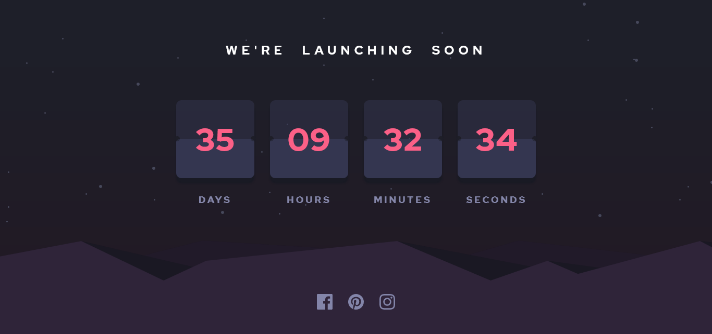

# Frontend Mentor - Launch countdown timer - Design Preview


 Frontend Mentor - Launch countdown timer solution

This is a solution to the [Launch countdown timer challenge on Frontend Mentor](https://www.frontendmentor.io/challenges/launch-countdown-timer-N0XkGfyz-). Frontend Mentor challenges help you improve your coding skills by building realistic projects. 

## Table of contents

- [Overview](#overview)
  - [The challenge](#the-challenge)
  - [Screenshot](#screenshot)
  - [Links](#links)
- [My process](#my-process)
  - [Built with](#built-with)
  - [What I learned](#what-i-learned)
  - [Continued development](#continued-development)
  - [Useful resources](#useful-resources)
- [Author](#author)
- [Acknowledgments](#acknowledgments)

## Overview

### The challenge

Users should be able to:

- See hover states for all interactive elements on the page
- See a live countdown timer that ticks down every second (do a count till christmas day, my tweak though, cause you know christmas is here)
- **Bonus**: When a number changes, make the card flip from the middle

### Screenshot of My Implementation



### Links

- Solution URL: [Github](https://github.com/Minard-NG/FrontendMentor-launch-countdown-timer/blob/main/index.html)
- Live Site URL: [Hosted with Netlify](https://xmaslaunch.netlify.app/)

## My process

### Built with

- Semantic HTML5 markup
- CSS3
- Flexbox
- CSS Grid
- Mobile-first workflow
- Git and GitHub

### What I learnt

I have been reading up a couple of articles/books on the importance of semantic HTML and the very many benefits it offers, accessibility being one of major benefits. So currently I try as much to give my HTML structure enough semantic as much as I possibly can; that involves me always asking myself which HTML tag would best semantically convey the importance of every section on the webpage, while ensuring I use alt attributes for images and try to ensure the document flow is in other. Hey yo, I'm probably not yet a 100% complaint but I believe I would keep getting better as I remain more conscious of it. For this project, here is a top-level break down of the semantic layout.

```html
<header> Contains the page's header message </header>
<main> All the awesome timer stuff went in here </main>
<footer> Contains the social media links </footer>
```

The laying out of the page's background was an interesting learning process for me. It provided a good use case for me to implement the ::before and ::after CSS pseudo-selector.  I used the ::before to layout the stars svg on the background while the ::after, I used to layout the hills svg on the background. It was really helpful in providing some level of structure without affecting the markup of the document. The background of the page used a linear gradient that flowed between two colors from top to bottom.

The entire page was layed out using the CSS3 grid display property. I have just learnt about CSS grid a couple of weeks ago and decided to test it out with this project, I used 3 rows / 1 column template. It did provide a neat control of the page's flow without much media queries. I'm still trying to wrap my heads around some of the custom units it provides such as: fit-content, auto-fill, minmax() etc. and its use-cases. 

####Code Snippet for the grid:
```css
.grid {
  //other styles
  display: grid;
  grid-template: 0.3fr minmax(6.25rem, 0.2fr) 0.5fr / 1fr;
}
```

Using google fonts to add custom fonts for my web projects has been a defacto for me. But I had tried accessing the google fonts website for while developing this project but all the time I tried the site would not open on my device, still researching what the issue is, but in the mean time, I decided to implement the custom 'Red Hat' font used for this project by dowloading it from font squirrel and using the @font-face selector. It provided a good work around but I noticed some lag whenever the page loads when I deployed it. 

####Code Snippet for custom Font:
```css
@font-face {
  font-family: "Red Hat";
  src: url("/font/red-hat/RedHatDisplay-Bold.otf") format("opentype");
  font-weight: 700;
  font-style: normal;
}
```

Use this section to recap over some of your major learnings while working through this project. Writing these out and providing code samples of areas you want to highlight is a great way to reinforce your own knowledge.

To see how you can add code snippets, see below:

```html
<h1>Some HTML code I'm proud of</h1>
```
```css
.proud-of-this-css {
  color: papayawhip;
}
```
```js
const proudOfThisFunc = () => {
  console.log('🎉')
}
```

If you want more help with writing markdown, we'd recommend checking out [The Markdown Guide](https://www.markdownguide.org/) to learn more.

**Note: Delete this note and the content within this section and replace with your own learnings.**

### Continued development

Use this section to outline areas that you want to continue focusing on in future projects. These could be concepts you're still not completely comfortable with or techniques you found useful that you want to refine and perfect.

**Note: Delete this note and the content within this section and replace with your own plans for continued development.**

### Useful resources
https://www.sitepoint.com/build-javascript-countdown-timer-no-dependencies/

- [Example resource 1](https://www.example.com) - This helped me for XYZ reason. I really liked this pattern and will use it going forward.
- [Example resource 2](https://www.example.com) - This is an amazing article which helped me finally understand XYZ. I'd recommend it to anyone still learning this concept.

**Note: Delete this note and replace the list above with resources that helped you during the challenge. These could come in handy for anyone viewing your solution or for yourself when you look back on this project in the future.**

## Author

- Website - [Add your name here](https://www.your-site.com)
- Frontend Mentor - [@yourusername](https://www.frontendmentor.io/profile/yourusername)
- Twitter - [@yourusername](https://www.twitter.com/yourusername)

**Note: Delete this note and add/remove/edit lines above based on what links you'd like to share.**

## Acknowledgments

This is where you can give a hat tip to anyone who helped you out on this project. Perhaps you worked in a team or got some inspiration from someone else's solution. This is the perfect place to give them some credit.

**Note: Delete this note and edit this section's content as necessary. If you completed this challenge by yourself, feel free to delete this section entirely.**


